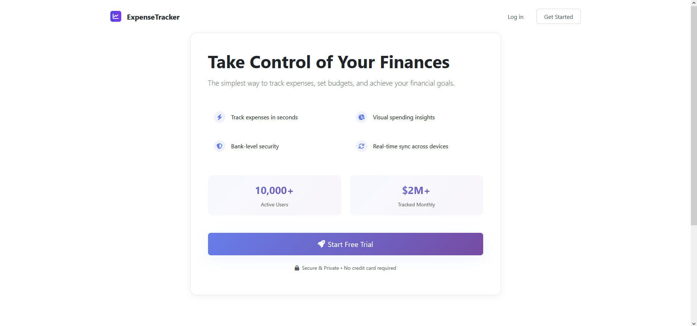
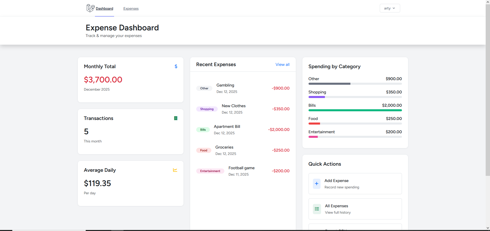
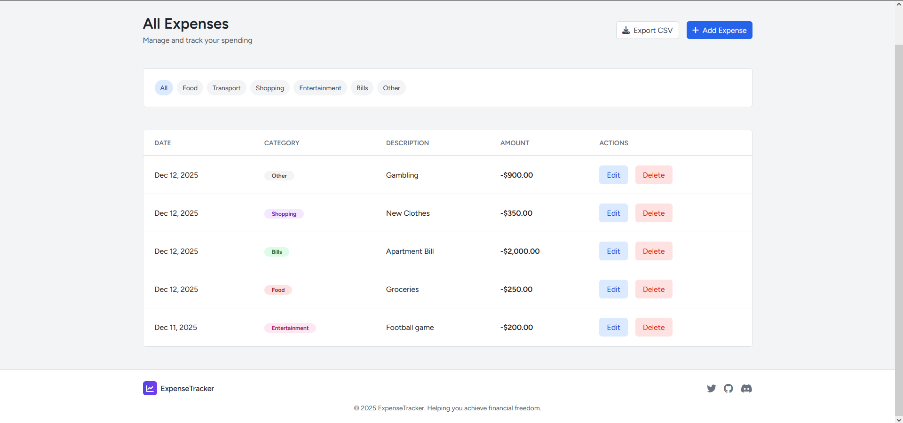

# 📊 Expense Tracker - Laravel Course Project







Проект для курса PHP/Laravel - система учета личных расходов с полной аутентификацией и архитектурой по шаблонам Repository/Service.

## 🎯 Функциональность

### ✅ Аутентификация и безопасность
- Регистрация с подтверждением email (MailHog для разработки)
- Вход/выход из системы
- Защита маршрутов middleware (auth + verified)

### ✅ Управление расходами
- **CRUD операции**: создание, просмотр, редактирование, удаление расходов
- **Категории**: Еда, Транспорт, Шопинг, Развлечения, Счета, Другое
- **Фильтрация**: по категории, месяцу, году
- **Экспорт данных**: CSV формат

### ✅ Статистика и отчеты
- Общая сумма расходов за месяц
- Список всех транзакций с сортировкой по дате

## 🏗️ Архитектура

Проект реализован с использованием профессиональных шаблонов проектирования:

```
App/
├── Http/Controllers/     ← Тонкие контроллеры
├── Services/            ← Бизнес-логика (слой сервисов)
│   └── Interfaces/      ← Контракты сервисов
├── Repositories/        ← Работа с данными (паттерн Repository)
│   └── Interfaces/      ← Контракты репозиториев
├── Models/              ← Модели Eloquent
├── Http/Requests/       ← Валидация форм
└── Providers/           ← Service Providers для DI
```

### 📦 Используемые технологии
- **Laravel 12** - PHP фреймворк
- **Breeze** - аутентификация
- **SQLite/MySQL** - база данных
- **Repository/Service Pattern** - архитектура
- **Dependency Injection** - внедрение зависимостей
- **PHPUnit** - тестирование (29 тестов)

## 🚀 Установка и запуск

### Требования
- PHP 8.2+
- Composer
- Node.js (для фронтенда)
- SQLite или MySQL

### Шаги установки

1. **Клонирование репозитория**
   ```bash
   git clone [your-repo-url]
   cd expense-tracker
   ```

2. **Установка зависимостей**
   ```bash
   composer install
   npm install
   npm run build
   ```

3. **Настройка окружения**
   ```bash
   cp .env.example .env
   php artisan key:generate
   ```

4. **Настройка базы данных** (SQLite)

   В файле `.env` установите:
   ```env
   DB_CONNECTION=sqlite
   # DB_DATABASE=путь/к/database.sqlite
   ```

   Создайте файл базы данных:
   ```bash
   touch database/database.sqlite
   ```

5. **Миграции и сиды**
   ```bash
   php artisan migrate
   # Опционально: php artisan db:seed
   ```

6. **Запуск разработческого сервера**
   ```bash
   php artisan serve
   ```

7. **Для тестирования email-верификации** (опционально)

   Запустите MailHog в Docker:
   ```bash
   docker run -d -p 8025:8025 -p 1025:1025 mailhog/mailhog
   ```

## 🧪 Тестирование

Проект покрыт 29 тестами (PHPUnit):

# Запуск всех тестов
php artisan test

# Результаты тестов:
✓ AuthTest: 8 тестов (регистрация, вход, выход, верификация)
✓ ExpenseTest: 10 тестов (CRUD операции, валидация, экспорт CSV)
✓ ExpenseServiceTest: 5 тестов (бизнес-логика сервисов)
✓ ProfileTest: 5 тестов (Breeze)
✓ ExampleTest: 1 тест
──────────────────────────────
Всего: 29 тестов ✓

Этот проект создан в учебных целях. Все права на Laravel принадлежат их соответствующим владельцам.

## 🎓 Особенности реализации

### 1. Паттерн Repository
- Изоляция слоя данных от бизнес-логики
- Легкая замена реализации (Eloquent → MongoDB и т.д.)
- Упрощенное тестирование

### 2. Сервисный слой
- Вся бизнес-логика вынесена в сервисы
- Чистые контроллеры (только HTTP-логика)
- Повторное использование кода

### 3. Dependency Injection
- Автоматическое разрешение зависимостей
- Гибкая конфигурация через Service Providers
- Соблюдение принципа инверсии зависимостей (DIP)

### 4. Валидация через Form Requests
- Отдельные классы для валидации
- Чистая архитектура контроллеров
- Повторное использование правил валидации

## 📁 Структура проекта

```bash
expense-tracker/
├── app/
│   ├── Http/
│   │   ├── Controllers/
│   │   │   ├── ExpenseController.php
│   │   │   └── Auth/
│   │   └── Requests/
│   │       ├── StoreExpenseRequest.php
│   │       └── UpdateExpenseRequest.php
│   ├── Models/
│   │   ├── User.php
│   │   └── Expense.php
│   ├── Repositories/
│   │   ├── Interfaces/
│   │   │   ├── ExpenseRepositoryInterface.php
│   │   │   └── UserRepositoryInterface.php
│   │   ├── ExpenseRepository.php
│   │   └── UserRepository.php
│   ├── Services/
│   │   ├── Interfaces/
│   │   │   ├── ExpenseServiceInterface.php
│   │   │   └── AuthServiceInterface.php
│   │   ├── ExpenseService.php
│   │   └── AuthService.php
│   └── Providers/
│       └── RepositoryServiceProvider.php
├── tests/
├── resources/views/
│   └── expenses/
│       ├── index.blade.php
│       ├── create.blade.php
│       └── edit.blade.php
└── routes/
    └── web.php
```

## 👤 Автор

Артем Галимов
- Курс: Топ Академия
- Группа: ПВ318
- Год: 2025
- Email: artjom-05@mail.ru

## 📄 Лицензия
